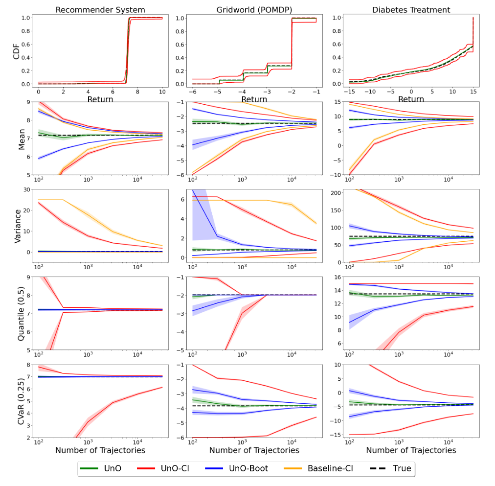

# UnO: Universal Off-Policy Evaluation


This repository contains the code for the following paper.

> Y. Chandak, S. Niekum, B. Castro da Silva, E. Learned-Miller, E. Brunskill, and P. S. Thomas. Universal Off-Policy Evaluation. In Advances in Neural Information Processing Systems, 2021. 


Addtionally, this repository contains code for the baselines that provide high-confidence bounds for the mean and variance, respectively:

> P. S. Thomas, G. Theocharous, and M. Ghavamzadeh. High Confidence Off-Policy Evaluation. In Proceedings of the Twenty-Ninth AAAI Conference on Artificial Intelligence, 2015.

> Y. Chandak, S. Shankar, and P. S. Thomas. High Confidence Off-Policy (or Counterfactual) Variance Estimation. In Proceedings of the Thirty-Fifth AAAI Conference on Artificial Intelligence, 2021


## Requirements

The code for environments and agents which are used for collecting trajectories are written in Python (+Pytorch). 
The code for UnO estimator and bounds are written in Julia. This design choice was made to ensure faster runtimes during analysis.   


## Data Collection

For the stationary setting, the following files  contain python code to collect data:
- Src/run_Diabetes.py
- Src/run_Maze.py
- Src/run_Reco.py

For the non-stationary setting, the following file contains python code to collect data:
- Environments/NS_Reco.py  

## UnO Estimators + Bound

Code for estimating and bounding the CDF of returns:
- Src/UnO_CDF.jl 

Code for estimating and bounding parameters of the CDF of returns:
- Src/UnO_params.jl 

## Baselines

Code for the bound on the mean return [Thomas et al. (2015)]:
- Src/HCOPE.jl


Code for the bound on the variance of returns [Chandak et al. (2021)]:
- Src/HCOVE.jl

## Plots

To reproduce the plots in the paper, execute:
- Src/Plots/UnO_runner.jl
- Src/Plots/UnO_plot.py





## Bibliography

```bash
@article{chandak2021universal,
  title={Universal Off-Policy Evaluation},
  author={Chandak, Yash and Niekum, Scott and da Silva, Bruno Castro and Learned-Miller, Erik and Brunskill, Emma and Thomas, Philip S},
  journal={Advances in neural information processing systems},
  year={2021}
}
```